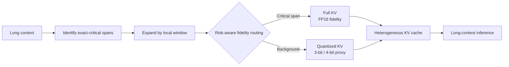

<div align="center">

# RiskKV

### Risk-Aware Heterogeneous KV Cache Compression

**A research prototype for routing exact-critical context to full-fidelity KV while compressing lower-risk background context with low-bit quantization.**

[](https://github.com/Ahmet2001/RiskKV/actions/workflows/basic.yml)
[](LICENSE)
[](requirements.txt)
[](#current-status)

</div>

---

## Overview

Long-context language-model inference is often limited by the memory footprint and bandwidth cost of the **key-value (KV) cache**. Many compression methods either:

- evict selected tokens, or
- quantize the entire cache at one uniform precision.

**RiskKV explores a different question:**

> Instead of asking only *which tokens should remain?*, can we ask *which fidelity should each token receive?*

The current prototype keeps known **exact-critical spans**—such as identifiers, dates, code strings, quoted values, negations, secret markers, and key-value facts—at full KV fidelity, while quantizing lower-risk background context to 3-bit or 4-bit representations.

The goal is not to claim that heterogeneous precision always beats uniform quantization. Rather, RiskKV studies **when preserving a small set of brittle exact-recall tokens at higher fidelity can help under aggressive KV compression**.

---

## Method



In one line:

```text
exact-critical tokens ± local window  -> Full KV
all remaining background tokens       -> low-bit Quantized KV
```

For a cache with token-wise fidelity assignments, the effective memory ratio is approximated as

```text
R_eff = mean(1.0 for Full-KV tokens, bits/16 for quantized tokens)
```

where FP16 is treated as the full-fidelity reference.

---

## Why this is interesting

Exact-recall tasks are brittle. A token can look unimportant before the query is known and later become the only token that determines the correct answer.

For example:

```text
... routine background text ...
Secret marker: MK53-4897X.
... more background text ...

Question: Which marker was labeled as the secret marker?
```

Uniform low-bit quantization treats the marker and the filler text identically. RiskKV tests whether reserving higher fidelity for the exact-critical span can preserve recall while keeping most of the cache compressed.

---

## Results at a glance

### Qwen2.5-0.5B-Instruct — up to 2K context

| Policy | Effective memory | Accuracy | Gold NLL | Margin |
|---|---:|---:|---:|---:|
| Full KV | 1.000 | 0.978 | 4.184 | 15.474 |
| **4-bit RiskKV** | **0.264** | **0.967** | **3.345** | **15.288** |
| 4-bit quant-only | 0.250 | 0.922 | 3.993 | 14.493 |
| **3-bit RiskKV** | **0.203** | **0.889** | **2.792** | **15.095** |
| 3-bit quant-only | 0.188 | 0.811 | 4.980 | 13.247 |

### Qwen2.5-0.5B-Instruct — 4K to 16K context

At nearly identical 3-bit effective memory:

| Policy | Effective memory | Accuracy | Gold NLL | Margin |
|---|---:|---:|---:|---:|
| **3-bit RiskKV** | **0.189** | **0.822** | **6.086** | **15.065** |
| 3-bit quant-only | 0.188 | 0.644 | 9.528 | 12.144 |

At **16K specifically**, RiskKV reaches **0.933 accuracy** versus **0.733** for uniform 3-bit quantization.

### Larger-model check: Qwen2.5-1.5B-Instruct at 8K

The larger-model runs also reveal an important failure regime:

| Setting | RiskKV | Quant-only |
|---|---:|---:|
| 3-bit accuracy | 0.240 | **0.360** |
| 4-bit accuracy | 0.760 | **0.800** |

These runs show that the current routing strategy is **not universally better** than uniform quantization. RiskKV is therefore best understood as a controlled proof-of-concept for heterogeneous fidelity allocation.

Full result files:

- [`results/aggregate_results.csv`](results/aggregate_results.csv)
- [`results/hm19_hm20_bigger_model.csv`](results/hm19_hm20_bigger_model.csv)
- [`docs/experiments_summary.md`](docs/experiments_summary.md)

---

## Current status

> [!IMPORTANT]
> RiskKV is an **early research prototype**, not a production KV-cache backend.

The current implementation:

- uses **quantize/dequantize simulation** on FP16 KV tensors;
- does **not** implement packed 3-bit or 4-bit KV storage kernels;
- reports `effective_kv_mb` as an intended packed-cache estimate rather than measured packed-kernel GPU memory;
- uses synthetic controlled exact-recall tasks;
- currently routes **known annotated exact spans** rather than predicting risk with a learned detector.

This last point is especially important: the present experiments should be interpreted as testing the **value of heterogeneous fidelity when exact-critical positions are known**, not as demonstrating a complete automatic risk detector.

See [`docs/todo.md`](docs/todo.md) for the planned research extensions.

---

## Quick start

### 1. Clone the repository

```bash
git clone https://github.com/Ahmet2001/RiskKV.git
cd RiskKV
```

### 2. Install dependencies

```bash
pip install -r requirements.txt
```

### 3. Run a small experiment

```bash
python experiments/forced_choice_proxy.py \
  --model Qwen/Qwen2.5-0.5B-Instruct \
  --context 2048 \
  --bits 4 \
  --cases 2 \
  --out outputs/demo
```

The script evaluates three policies:

- `full` — full-fidelity KV;
- `quant_only` — uniform low-bit quantization;
- `ours_core` — heterogeneous RiskKV routing.

It reports accuracy, effective memory ratio, gold-answer NLL, and answer margin.

---

## Reproducing the included runs

Convenience scripts are provided for the main configurations:

```bash
bash scripts/run_qwen05b_16k_3bit.sh
bash scripts/run_qwen15b_8k_3bit.sh
bash scripts/run_qwen15b_8k_4bit.sh
```

A CUDA-capable GPU is recommended for the longer-context experiments.

---

## Controlled benchmark data

The repository also includes a synthetic exact-recall benchmark under [`hf_dataset/`](hf_dataset/).

The dataset defines several controlled task families:

- `single_needle`
- `multi_needle`
- `kv_retrieval`
- `code_string`
- `date_negation`

Example fields include the context, query, gold answer, distractors, answer choices, and annotated exact spans.

> [!NOTE]
> The current main executable focuses on the single-needle forced-choice setup. The broader dataset is included for extending the evaluation.

See [`hf_dataset/README.md`](hf_dataset/README.md) for the dataset schema and examples.

---

## Repository structure

```text
RiskKV/
├── experiments/
│   └── forced_choice_proxy.py      # Main proxy implementation
├── scripts/
│   ├── run_qwen05b_16k_3bit.sh
│   ├── run_qwen15b_8k_3bit.sh
│   └── run_qwen15b_8k_4bit.sh
├── results/
│   ├── aggregate_results.csv       # HM16 / HM17 / HM18
│   └── hm19_hm20_bigger_model.csv # 1.5B validation
├── hf_dataset/                     # Controlled exact-recall data
├── docs/
│   ├── experiments_summary.md
│   ├── project_story.md
│   └── todo.md
├── paper/
│   └── paper.md                    # Paper summary / research notes
├── CITATION.cff
├── LICENSE
└── README.md
```

---

## Research direction

RiskKV is built around the hypothesis that **KV-cache compression can be formulated as fidelity allocation, not only token retention**.

Natural next steps include:

- automatic or learned risk scoring;
- stronger non-oracle routing signals;
- more than two precision tiers;
- token- and layer-aware routing;
- packed low-bit KV kernels;
- broader long-context benchmarks;
- stronger eviction and quantization baselines.

The research questions and known gaps are tracked in [`docs/todo.md`](docs/todo.md).

---

## Citation

If you use this repository, please cite the project using [`CITATION.cff`](CITATION.cff).

GitHub can generate citation metadata directly from that file via the repository's **Cite this repository** interface.

---

## Getting help

If you find a bug, have a reproduction issue, or want to discuss an experiment, please [open a GitHub issue](https://github.com/Ahmet2001/RiskKV/issues).

When reporting an experiment problem, it is helpful to include:

- model name;
- context length;
- quantization bit-width;
- GPU / CUDA environment;
- command used;
- relevant output or traceback.

---

## Maintainer

Maintained by [@Ahmet2001](https://github.com/Ahmet2001).

Contributions, issue reports, and research discussions are welcome.

---

## License

This project is released under the [MIT License](LICENSE).
